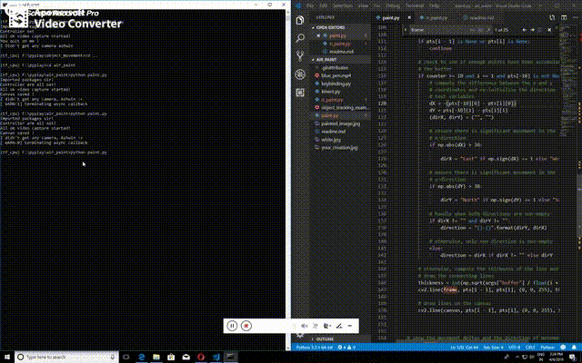

## You can paint in air !
Using opencv and this amazing tutorial on object detection by Adrian- https://www.pyimagesearch.com/2014/08/04/opencv-python-color-detection/.

You would require to install cv2, argparse

Open up the file to the directory and run with a webcam(remember to have atleast one camera device activated) you can also use a video just give it as an argument while running, hint in the code.

The device we would be using to detect your movement is any red colored object of the size of your palm.
If you want a different colored object then you need to change appropriate hsv values.

for air paint run

`python paint.py`

if you want mouse controls run

`python n_paint.py`

Here's a gif demo -

